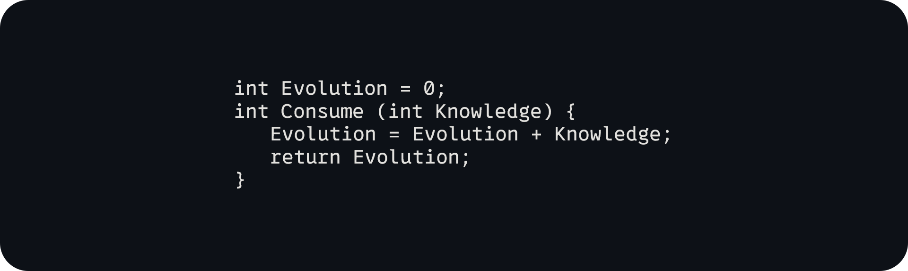

<!-- Replace these placeholders with your personal information and details -->

  

<h1 align="center">👋 Hello, I'm Diron</h1>

  BS Cybersecurity Student | Designer | Developer

 
      

  

  

<h2 align="center">🚀 About Me</h2>

  I'm a passionate BS Cybersecurity student based in Paris, France, with a background in design and development. My journey revolves around securing the digital world and creating elegant solutions.

  

<h2 align="center">🧰 Languages and Tools</h2>

  
  
  
  
  
  
  
  
  
  
  
  
  
  

  

  Thanks for visiting! 😊

